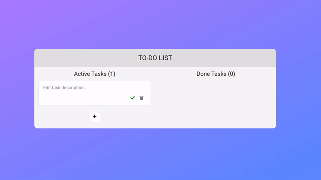

# :memo: To-Do List WebApp

 
  

 
  

  

  <a aria-label="try expo crossy road in the browser" href="https://todo-list.akinncar.vercel.app/"><b>Experimente no seu navegador</b></a>

## :dart: Objetivo

Desenvolver um webapp, com as funcionalidades de uma lsita de tarefas onde o usuário possa adicionar uma nova tarefa, edita-la, marca-la como feita, e excluí-la.

## :hammer: Tecnologias e Recursos

<ul>
  <li>ReactJS</li>
  <li>Typescript</li>
  <li>Styled Components</li>
  <li>Context API</li>
  <li>Async Storage</li>
  <li>React DnD (Drag and Drop)</li>
  <li>Testing Library</li>
</ul>

- [ReactJS](https://reactjs.org/)
- [Typescript](https://www.typescriptlang.org/)
- [Styled Components](https://styled-components.com/)
- [React DnD (Drag and Drop)](https://react-dnd.github.io/react-dnd/about)
- [Async Storage](https://developer.mozilla.org/pt-BR/docs/Web/API/Window/Window.localStorage)
- [Testing Library](https://testing-library.com/docs/react-testing-library/intro/)

## :computer: Instalação

**Se você nunca rodou um projeto React, é necessário instalar o [Node >= 8.10 e npm >= 5.6](https://nodejs.org/en/), e também o [Yarn](https://classic.yarnpkg.com/en/docs/install/#windows-stable).**

Para rodar o projeto na sua máquina, você terá que instalar as dependências do projeto com yarn:

`$ yarn`

Após instalar todas as dependências, para rodar o projeto em ambiente local, você pode rodar em seu terminal:

`$ yarn start`

Você também pode executar os testes da aplicação rodando:

`$ yarn test`

Se desejar publicar o app, é possível gerar o build do mesmo e envia-lo para produção utilizando os eguinte comando:

`$ yarn build`

## :closed_book: Licença

Este código-fonte está disponível sob a [licença MIT](LICENSE). Algumas das dependências são licenciadas de forma diferente, com a licença BSD, por exemplo.

## :boy: Contato

Akinn Rosa - [Github](https://github.com/akinncar) - **[akinncar@hotmail.com](mailto:akinncar@hotmail.com)**
